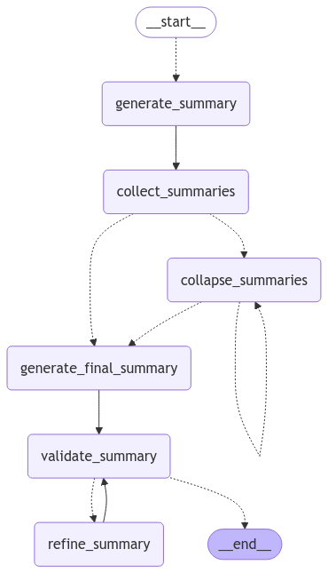

# Summary AI 

The **Summary AI** is a FastAPI-based web application designed to provide intelligent text summarization using AI agents powered by advanced language models. The application can handle large text inputs by leveraging Langgraph agents in conjunction with other tools to recursively break text into smaller, semantically meaningful pieces, summarize, and recombine. The language models can be run locally using ollama, and the app is dockerized for full self containment. It is well suited to large bodies of text with a table of content, and useful for students and professionals who need to quickly synthesize information from a large corpus.

## Key Features

- **Single-Agent Summarization**: Users can submit a single text document, and the application will generate a summary that captures the main points and essential details. Runs relatively quickly and can handle large bodies of text.
  
- **Multi-Agent Summarization**: The application can also handle multiple sections of text concurrently, providing summaries for each section, then combining and refining them, using multiple specialized agents, into a cohesive overview.

- **Asynchronous Processing**: Asynchronous processing speeds up text summary and enables processing of large files.

- **Customizable**: Users can easily modify the input text and adjust parameters to tailor the summarization process to their specific needs.

- **Dockerized Deployment**: The application is packaged in a Docker container, allowing for easy deployment and scalability across different environments.

## Technologies Used

- **FastAPI**: A modern web framework for building APIs with Python, known for its speed and ease of use.
- **Ollama**: A powerful tool that enables local hosting of language models to allow advanced natural language processing capabilities.
- **LangChain**: A framework that simplifies the integration of language models into applications, enabling complex agentic workflows. The summary AI workflow is depicted in the image below.
- **Docker**: Containerization technology that allows the application to run consistently across different environments.



## Prerequisites

1. **Install Docker Desktop**: Ensure Docker is installed and running on your machine.
   - For Mac, you can install it via Homebrew:
     ```bash
     brew install --cask docker
     ```
   - Alternatively, download it from [Docker's official website](https://www.docker.com/products/docker-desktop).

2. **Install Ollama**: Follow the instructions on the [Ollama website](https://ollama.com/) to install Ollama.

3. **Download the required model**: Run the following command to pull the models:
   ```bash
   ollama pull llama3.2:3b-instruct-q5_K_M
   ollama pull deepseek-r1:1.5b
   ```

## Setup Steps

1. **Clone the repository**:
   ```bash
   git clone https://github.com/Tolani-O/summary.ai.git
   cd <repository-directory>
   ```

2. **Start the Ollama server** in a terminal:
   ```bash
   ollama serve
   ```

3. **Build the Docker image**:
   ```bash
   docker build -t summary-agent .
   ```

4. **Run the Docker container**:
   ```bash
   docker run -p 8000:8000 --add-host=host.docker.internal:host-gateway summary-agent
   ```

## Testing the API

In a new terminal, you can run the test script to verify the API functionality:

1. **Make the script executable** (if you haven't already):
   ```bash
   chmod +x test.sh
   ```

2. **Run the test script**:
   ```bash
   ./test.sh
   ```
   
Note that the included `test.sh` script assumes the file `sample_text/understanding-machine-learning-theory-algorithms.pdf` exists. Tou can also test the API endpoints directly using cURL in `test.sh`, shown below.

   ```bash
   input_path="sample_text/understanding-machine-learning-theory-algorithms.pdf"
   mode="single"
   log_output_path="sample_text/log.txt"
   summary_output_path="sample_text/summary.txt"
   agent_url="http://localhost:8000/summarize"
   
   # Test endpoint
   curl -X POST "$agent_url" \
     -H "Content-Type: application/json" \
     -d '{
           "input_path": "'"${input_path}"'",
           "mode": "'"${mode}"'",
           "log_output_path": "'"${log_output_path}"'",
           "summary_output_path": "'"${summary_output_path}"'"
         }'
   ```

Summarization results will be saved to the `summary_output_path` specified in the script, and logs will be saved to the `log_output_path`. The app runs in two modes: `single` and `multi`. The 'multi' mode has an additional validation to test and refine the summary after the summary agent completes. The quality of the summary also largely depends on the abilities of the language model used.